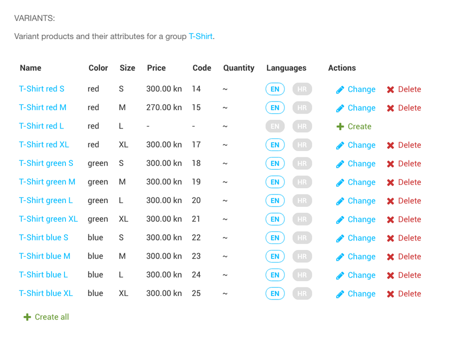

Product
#######

About the **Product** model.

----

Type of Products
================

There are 3 kinds of products:

* ``SINGLE`` are products without variations.
* ``GROUP`` are products that hold variants and their common info, they cannot be added to cart.
* ``VARIANT`` are variations of a product that must select a Group, and set their unique attributes.

Each of the kinds have their set of rules, and a different validation in admin.

Single products
---------------

A simplest form of a **Product**. Only requirement is to set the ``name``, ``slug``, ``code`` & ``unit_price``.

Group products
--------------

Group products hold common info of their variations and are not considered an actual product that can be added to
the cart. They have to specify ``availible_attributes`` for the variants to use. Variants of a group that don't use
those attributes will be considered `invalid`.

Variant products
----------------

Variants must specify a group, as well as their unique set of attributes. All attributes specified
in ``availible_attributes`` of a group, need to be added. Variants are best added through the custom
`variants` field in products admin. Every combination of a variant can be created automatically,
and invalid variants deleted as well.

Variants can leave most of their fields empty to inherit them from a group. Or choose to override them.

Categorization
==============

Categorization is separated into ``Category``, ``Brand`` & ``Manufacturer`` models. Tree management is
handled by the `django-mptt <https://github.com/django-mptt/django-mptt>`_ project. **Modifiers** and in case
of category, **Tax** can be set in categorization to apply to a group of products.

Pricing & availability
======================

Product pricing section consists of a ``unit_price``, ``discount``, ``tax`` & ``summary`` fields.
Discount and tax field are ment for per products use. When different taxes or discounts are required on a product.
These values are embeded into a price, when for example you want to have tax included in a price. A summary
field shows calculated values in a custom admin field, for convenience.

Stock
-----

``quantity`` field is used to keep a record of availible units to ship. Leave empty if product is always available,
or set to ``0`` if product is not available.

Flags
=====

Custom checkbox flags can be added to the **Product** or to a categorization layer. This allows to easily
separate a group of products to display in a different way on site.

Measurements
============

Measuerments fields are powered by the `django-measurement <https://github.com/coddingtonbear/django-measurement>`_ project.
``width``, ``height``, ``depth``, and ``weight`` is available.

Attributes
==========

Attribute model lets you design custom attributes with their choices. These attributes are then selected in
``availible_attributes`` field on a group product, and used to create product variations.

Other inlines
=============

Product model has couple of inline models like ``Attachment`` that allows you to add **image**, **video** & **file**
attachments to a product. ``Relation`` that allows you to add customized relations between products. ``Review`` that
let's you manage product customer reviews.
